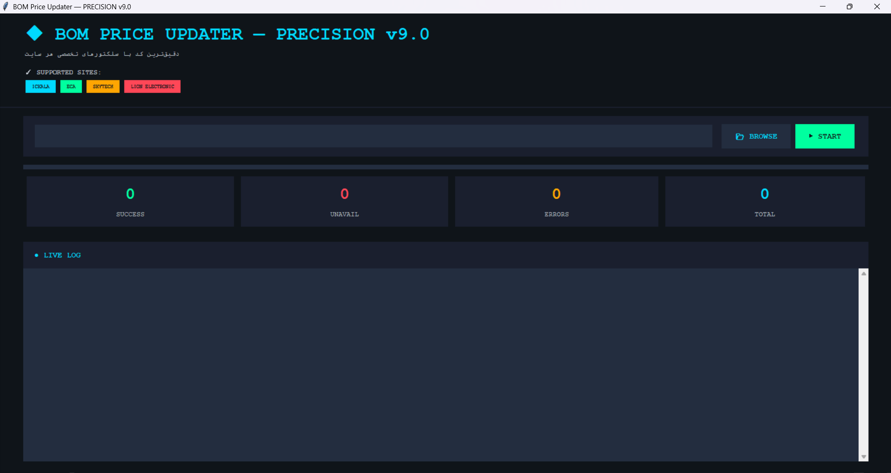

# Iran BOM Price Updater

یک ابزار دسکتاپ پایتون برای به‌روزرسانی قیمت قطعات BOM از روی فایل Excel و لینک‌های خرید قطعات در سایت‌های ایرانی فروش قطعات الکترونیک.

این پروژه به عنوان یک کار جانبی و برای حل یک مشکل واقعی ساخته شد:  
استعلام دستی قیمت قطعات از چند سایت مختلف، مخصوصاً وقتی بعضی قطعات ناموجود هستند یا قیمت‌ها تغییر کرده‌اند، زمان زیادی می‌گیرد.  
این ابزار تلاش می‌کند این فرایند را تا حد زیادی خودکار کند.

---

## قابلیت‌ها

- خواندن فایل Excel با فرمت `.xlsx`
- استخراج خودکار لینک خرید قطعات از سلول‌ها
- دریافت قیمت قطعه از صفحه محصول
- تشخیص وضعیت ناموجود بودن
- محاسبه قیمت نهایی هر ردیف
- تولید فایل خروجی Excel به‌روزشده
- ساخت نسخه پشتیبان از فایل اصلی
- رابط گرافیکی ساده با Tkinter
- نمایش لاگ زنده هنگام پردازش

---

## سایت‌های پشتیبانی‌شده در نسخه فعلی

- ICKALA
- ECA
- SkyTech
- Lion Electronic

برای سایر سایت‌ها نیز تلاش می‌شود استخراج عمومی انجام شود، اما دقت آن به ساختار صفحه بستگی دارد.

---

## شرایط و ساختار فایل ورودی

برای اینکه برنامه درست کار کند، فایل Excel باید این ساختار را داشته باشد:

- فرمت فایل: `.xlsx`
- لینک خرید قطعه در **ستون G** باشد
- تعداد موردنیاز قطعه در **ستون D** باشد
- داده‌ها از **ردیف 2** به بعد خوانده می‌شوند
- شیت فعال فایل به‌عنوان ورودی پردازش می‌شود
- اگر لینک به صورت Hyperlink ثبت شده باشد، برنامه همان لینک را می‌خواند
- اگر Hyperlink نباشد، خود مقدار سلول بررسی می‌شود

---

## خروجی برنامه

برنامه دو ستون جدید به فایل اضافه می‌کند:

- `UNIT PRICE`
- `TOTAL`

سپس یک فایل جدید در پوشه `UPDATED_BOMS` ذخیره می‌شود.

---

## تکنولوژی‌های استفاده‌شده

- Python
- Requests
- BeautifulSoup
- OpenPyXL
- Tkinter
- lxml

---

## نکات مهم

- این پروژه برای استفاده روی فایل‌های BOM طراحی شده است، نه برای همه نوع اکسل
- دقت استخراج قیمت به ساختار صفحه هر فروشگاه بستگی دارد
- در صورت تغییر ساختار سایت‌ها، ممکن است نیاز به اصلاح selectorها باشد
- این ابزار جایگزین بررسی نهایی انسانی نیست، بلکه برای کاهش کار تکراری ساخته شده است

---

## چرا این پروژه ساخته شد؟

من این ابزار را به عنوان یک side project ساختم، چون در جریان کار طراحی برد، استعلام قیمت قطعات از چند فروشگاه مختلف تبدیل به یک کار تکراری و وقت‌گیر شده بود.  
هدف اصلی، ساده‌سازی همین فرایند بود، نه ساخت یک نرم‌افزار تجاری کامل.

---

## نحوه استفاده

1. در پوشه که فایل در آن موجود است فایل پابتون را با دستور python Bom_Price_Updater.py در cmd اجرا و فایل Excel را انتخاب کنید
2. روی Start بزنید
3. برنامه لینک‌ها را بررسی می‌کند
4. قیمت‌ها را استخراج می‌کند
5. فایل خروجی را در پوشه `UPDATED_BOMS` ذخیره می‌کند

---

## نصب

```bash
pip install requests beautifulsoup4 openpyxl lxml
python main.py

